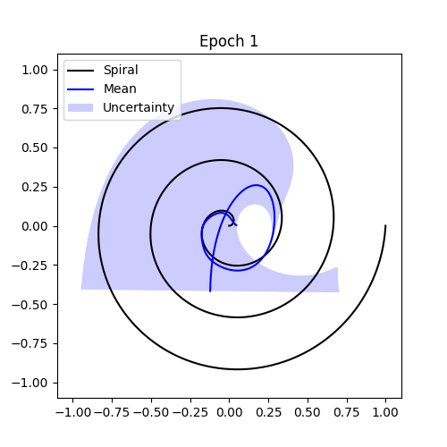

# Neuronal Stochastic Attention Circuit (NSAC)
---
The repository contains the code of the "Neuronal Stochastic Attention Circuit (NSAC) for Probabilistic Representation Learning".

## NSAC Model Usage Example

```python
import tensorflow as tf
from ouwrap import OUWrap
from losses import NSACLoss
from neuronal_attention_circuit import NAC
from neuronal_stochastic_attention_circuit import NSAC

def stochastic_model_fn():
    inputs = tf.keras.Input(shape=(1, 1))
    mean, log_std = OUWrap(
        NAC(d_model=64, num_heads=16, topk=8, sparsity=0.5),
        output_dim=1,                # Output dimension for regression 
        bn_mean=0.0,                 # Brownian mean
        bn_std=0.1,                  # Brownian standard deviation
        activation='sigmoid',        # Activation function
        return_sequences=False,      # Return full sequences if True, else last output
        return_attention=False,      # Return attention weights if True
        return_cell_state=False,     # Return cell potentials if True
        )(inputs)
    return tf.keras.Model(inputs, [mean, log_std])

model = NSAC(stochastic_model_fn(),
             mc_samples=5,           # Monte-Carlo steps 
             ood_mean=0.0,           # OOD generating noise mean 
             ood_std=5.0             # OOD generating noise standard deviation
             )

model.compile(
    optimizer=tf.keras.optimizers.AdamW(1e-3),
    loss=NSACLoss(),
)

```

### Continuous-time Function Approximation Verification

Demonstration and verification of NSAC’s CT function approximation capability with uncertainty.



---


